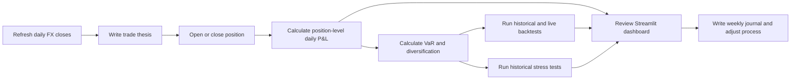

# EM FX Risk Book

A small, auditable emerging-market FX risk book for recording trade theses,
tracking hypothetical USD positions, marking daily P&L, and monitoring portfolio
risk. The project is designed as a **risk-management workflow**, not as an
automated trading strategy or a claim of investment performance.

The current universe is:

- USDTHB
- USDINR
- USDBRL
- USDZAR
- USDMXN

All pairs use the `USDXXX` convention: USD is the base currency and the local
currency is the quote currency.

## What the project answers

The book is built around practical desk questions:

1. What is the trade thesis and what macro drivers support it?
2. Which positions are open, closed, or pending?
3. How much P&L belongs to each individual position?
4. What is the current 1-day VaR at 95% and 99% confidence?
5. How much risk is reduced by diversification?
6. How often would the current book have breached VaR historically?
7. Has the live book breached its daily VaR since positions began being logged?
8. How would the current book behave during selected historical stress windows?

## End-to-end workflow



The CSV files are the system of record. The Streamlit dashboard is a control
and presentation layer over the same files and Python scripts.

## Components

| Component | Main file | Responsibility | Main output |
|---|---|---|---|
| Configuration | `config.py` | File paths, FX universe, VaR settings, thesis drivers | Shared constants |
| FX ingestion | `data_ingestion/fetch_fx.py` | Append new Yahoo Finance daily closes | `data/fx_rates.csv` |
| Trade thesis | `macro/trade_thesis.py` | Validate thesis IDs, directions, drivers, and conviction | `macro/trade_theses.csv` |
| Position book | `positions/positions.csv` | Store order lifecycle and optional thesis linkage | Position ledger |
| P&L engine | `pnl/pnl_calc.py` | Calculate close-to-close USD P&L by `position_id` | `data/daily_pnl.csv` |
| VaR engine | `risk/var_calc.py` | Historical and parametric VaR plus diversification | `data/var_summary.csv` |
| VaR backtest | `risk/backtest_var.py` | Constant-book historical replay and actual live-book exceptions | Two backtest CSV files |
| Stress testing | `risk/stress_test.py` | Apply selected historical FX windows to the current book | `data/stress_test_results.csv` |
| Dashboard | `dashboard/dashboard.py` | Operate and inspect the book | Streamlit application |
| Journal | `journal/_template.md` | Record decisions, outcomes, and process improvements | Weekly Markdown notes |
| Tests | `tests/` | Validate P&L timing, thesis schema, and dashboard rendering | Test results |

## Repository structure

```text
live-em-fx-risk-book/
|-- config.py
|-- requirements.txt
|-- dashboard/
|   |-- dashboard.py
|   |-- common.py
|   `-- views/
|       |-- book.py
|       |-- performance.py
|       |-- risk_macro.py
|       `-- trade_thesis.py
|-- data/
|   |-- fx_rates.csv
|   |-- stress_scenarios.csv
|   `-- generated risk and P&L outputs
|-- data_ingestion/
|   `-- fetch_fx.py
|-- macro/
|   |-- trade_thesis.py
|   `-- trade_theses.csv
|-- positions/
|   `-- positions.csv
|-- pnl/
|   `-- pnl_calc.py
|-- risk/
|   |-- var_calc.py
|   |-- backtest_var.py
|   `-- stress_test.py
|-- journal/
|   `-- _template.md
`-- tests/
    |-- test_pnl_logic.py
    |-- test_trade_thesis.py
    `-- dashboard_smoke.py
```

## Core data contracts

### Trade thesis

`macro/trade_theses.csv` stores the qualitative decision before a position is
opened.

| Field | Meaning |
|---|---|
| `thesis_id` | Unique identifier such as `THESIS-0006` |
| `as_of_date` | Date the view was written |
| `pair` | USDXXX currency pair |
| `direction` | `LONG_USD` or `SHORT_USD` |
| `drivers` | Semicolon-separated controlled macro drivers |
| `custom_driver` | Optional driver outside the controlled list |
| `thesis` | One or two sentences describing what should happen and why |
| `conviction` | `high`, `medium`, or `low` |

The thesis does not generate a trade automatically. It preserves the human
decision and can be linked to a later position.

### Position book

`positions/positions.csv` is the order lifecycle ledger.

| Field | Meaning |
|---|---|
| `position_id` | Unique order identifier |
| `as_of_date` | Entry close date |
| `end_date` | Exit close date; blank means open |
| `pair` | USDXXX currency pair |
| `direction` | `LONG_USD` or `SHORT_USD` |
| `notional_usd` | Constant USD notional used for daily marking |
| `view_tag` | Short driver or execution tag |
| `rationale` | Position-specific rationale or execution note |
| `linked_thesis_id` | Optional link to the exact pre-trade thesis |

Direction convention:

```text
LONG_USD  = profits when USDXXX rises and the local currency weakens
SHORT_USD = profits when USDXXX falls and the local currency strengthens
```

## Calculation methodology

### Position timing

- `as_of_date` is treated as entry at that day's official close.
- The position begins earning P&L on the next available FX close.
- `end_date` is treated as exit at that day's close.
- The close-to-close move ending on `end_date` is included.
- A position opened and closed on the same date has no daily-close P&L.

There is intentionally no manual `entry_rate`. The daily risk book uses the
official close series as its common marking source.

### USD P&L return

For a USDXXX pair with previous close `S(t-1)` and current close `S(t)`, the
USD-translated daily P&L return is:

```text
usd_pnl_return = 1 - S(t-1) / S(t)
```

Position return and P&L are:

```text
direction_sign = +1 for LONG_USD, -1 for SHORT_USD
daily_return   = direction_sign * usd_pnl_return
daily_pnl_usd  = notional_usd * daily_return
```

This convention is used consistently by daily P&L, VaR, backtesting, and
stress testing.

### VaR

The current net exposure is calculated by pair before risk is estimated.

- **Historical simulation VaR:** replays the most recent 250 observed daily
  FX returns against the current net book and takes the relevant loss tail.
- **Parametric VaR:** applies a variance-covariance model and a normal
  quantile to the same 250-day return window.
- Both methods are reported at 95% and 99% confidence.
- Portfolio volatility is the standard deviation of hypothetical daily P&L
  divided by gross notional and annualized by `sqrt(252)`.

### Diversification

```text
diversification benefit = sum of stand-alone historical VaR - portfolio VaR
```

A positive value means cross-pair netting reduced estimated tail risk. Zero is
expected when the book contains only one net pair. A negative value can occur
when positions reinforce each other in the selected historical tail.

### Backtesting

The project deliberately separates two different questions:

- **Layer A — historical constant-book replay:** holds today's net book fixed
  and replays it across the available FX history. This asks whether a book
  shaped like the current one would have breached the 99% historical VaR
  threshold in past markets.
- **Layer B — live book:** reconstructs the positions actually active on each
  logged date, estimates VaR using only prior observations, and compares the
  next daily P&L with that threshold.

An exception occurs when:

```text
actual_pnl_usd < -var_usd
```

The rolling 250-observation traffic-light thresholds are:

| Zone | Exceptions |
|---|---:|
| Green | 0-4 |
| Yellow | 5-9 |
| Red | 10-250 |

Layer B should not be interpreted as a formal Basel backtest until it has a
sufficient live sample.

### Stress testing

Stress testing applies the cumulative USD P&L return between the first and
last available close inside each configured historical window. The scenarios
are stored in `data/stress_scenarios.csv` and currently cover:

- Taper Tantrum 2013
- EM Selloff 2018
- COVID Shock 2020
- Fed Hike Cycle 2022

Missing pair history is reported explicitly in the result rather than silently
treated as a valid zero shock.

## Operating the project

### Installation

```bash
git clone <repository-url>
cd live-em-fx-risk-book
python -m pip install -r requirements.txt
```

### Full command-line workflow

```bash
python data_ingestion/fetch_fx.py
python macro/trade_thesis.py
python pnl/pnl_calc.py
python risk/var_calc.py
python risk/backtest_var.py
python risk/stress_test.py
```

Recommended sequence:

1. Refresh the FX close history.
2. Write and validate the trade thesis.
3. Open, resize, or close positions.
4. Recalculate daily position-level P&L.
5. Recalculate VaR and diversification.
6. Run both VaR backtest layers.
7. Run stress tests when the book changes materially.
8. Review the dashboard.
9. Record the weekly outcome and process adjustment in the journal.

### Dashboard

```bash
streamlit run dashboard/dashboard.py
```

Dashboard pages:

| Page | Purpose |
|---|---|
| Overview | Current exposure, realized/unrealized P&L, open positions, and cumulative P&L |
| Order Book | Open and close positions and link them to an exact thesis |
| P&L Monitor | Portfolio charts, position summaries, and the auditable daily ledger |
| Trade Thesis | Capture direction, drivers, thesis, conviction, and thesis history |
| Risk Monitor | VaR comparison, diversification, Layer A, Layer B, and stress results |

The sidebar pipeline button runs validation, P&L, VaR, backtesting, and stress
testing. FX refresh is optional because it requires an external data request.

## Example output snapshot

The following values are examples from the generated files on **15 July 2026**.
The latest marked P&L observation in that snapshot is **14 July 2026**. These
numbers describe that saved run only; rerun the pipeline before using the
dashboard as a current view.

### P&L snapshot

| Metric | Saved result |
|---|---:|
| Position-day ledger rows | 105 |
| Latest mark date | 2026-07-14 |
| Aggregate marked P&L in the file | $12,922 |

### VaR and diversification snapshot

| Confidence | Historical VaR | Parametric VaR | Stand-alone VaR sum | Diversification benefit |
|---:|---:|---:|---:|---:|
| 95% | $4,108 | $4,293 | $10,180 | $6,072 / 59.6% |
| 99% | $6,081 | $6,072 | $17,897 | $11,816 / 66.0% |

Saved annualized portfolio volatility was approximately **3.6%**.

### Backtest snapshot

| Layer | Observations | Total breaches | Latest rolling breaches | Zone |
|---|---:|---:|---:|---|
| Layer A: constant-book historical replay | 2,367 | 31 | 0 | Green |
| Layer B: actual live book | 23 | 0 | 0 | Green* |

`*` Layer B has far fewer than 250 observations, so the green label is an
informal monitoring result rather than a formal Basel conclusion.

### Stress snapshot

| Scenario | Portfolio P&L | Interpretation note |
|---|---:|---|
| Taper Tantrum 2013 | $0 | Required pair history was unavailable; not a valid zero-risk result |
| EM Selloff 2018 | $52,704 | Gain for the saved book |
| COVID Shock 2020 | $91,393 | Gain for the saved book |
| Fed Hike Cycle 2022 | -$27,914 | Loss for the saved book |

## Assumptions and limitations

### Market data

- Daily closes come from Yahoo Finance through `yfinance`; availability,
  revisions, symbol quality, and holiday calendars are external dependencies.
- The project does not currently reconcile prices against an independent
  institutional source.
- Different pairs can have missing closes on different local holidays.
- Historical coverage may be insufficient for older stress windows.

### P&L

- This is hypothetical mark-to-market P&L, not broker or custodian P&L.
- Notional is held constant in USD for daily marking.
- There are no bid/ask spreads, slippage, brokerage fees, taxes, market impact,
  settlement effects, or liquidity adjustments.
- Carry, forward points, cross-currency basis, and collateral/funding costs are
  not included.
- Entry and exit are modeled at daily closes, so intraday execution prices and
  intraday risk are not represented.
- Summed daily P&L is an additive constant-notional series, not a compounded
  strategy NAV return.

### Risk estimates

- A 250-day window is a limited sample, especially for 99% tail estimation.
- Historical VaR assumes the selected historical observations are relevant to
  the current regime.
- Parametric VaR assumes a normal covariance framework and can understate
  skewness, fat tails, jumps, and changing correlations.
- VaR is not a maximum-loss estimate and says little about loss severity beyond
  the chosen quantile.
- Diversification is sample-dependent and can disappear during stressed
  correlation regimes.

### Backtesting and stress

- Layer A tests a fixed current portfolio over history; it is not a historical
  strategy backtest and does not reproduce decisions that would have been made
  at the time.
- Layer B is only meaningful after enough real position history accumulates.
- Basel-style traffic-light labels are used as a monitoring convention; this
  project is not a regulatory capital model.
- Stress scenarios use first-to-last close shocks and do not model the path,
  intraday drawdown, liquidity, or forced deleveraging within the window.
- A scenario result with missing pair data must not be treated as a complete
  portfolio result.

### Process and system design

- Generated outputs are snapshots and become stale whenever FX data or the
  position book changes. Always check the latest data date and rerun time.
- Active positions are selected using the machine's current calendar date,
  while market data may lag. The valuation date and position date therefore
  require explicit operational control.
- CSV files provide transparency but not database transactions, concurrent
  write protection, user permissions, or an immutable audit log.
- The dashboard is not an order-management system and never sends trades.
- Trade thesis fields are qualitative records; conviction is not calibrated to
  forecast accuracy or automatically converted into position size.
- There is no automatic data-quality alerting, limit escalation, or production
  scheduler.

## Testing

Run the calculation and schema tests:

```bash
python -m unittest tests/test_pnl_logic.py tests/test_trade_thesis.py -v
```

Run the Streamlit page smoke test:

```bash
python tests/dashboard_smoke.py
```

Current tests cover:

- Entry day exclusion and exit day inclusion.
- Direction reversal between long and short USD.
- Trade thesis schema validation and ID generation.
- Successful rendering of every dashboard page.

They do not yet provide full numerical regression coverage for VaR,
backtesting, stress testing, ingestion failures, or corrupted CSV inputs.

## Sensible next improvements

1. Introduce an explicit valuation date shared by positions and market data.
2. Add forward points, carry, transaction costs, and funding P&L.
3. Add data-quality checks for stale prices, gaps, and outliers.
4. Add numerical regression tests for VaR, exceptions, and stress results.
5. Store pipeline run metadata and as-of timestamps with every output.
6. Add marginal/component VaR and risk contribution by pair.
7. Add thesis outcome review: correct direction, realized P&L, and lesson.
8. Move from CSV files to a small database if concurrent users or a formal
   audit trail become necessary.

## Intended use

This repository is for learning, portfolio demonstrations, and disciplined
risk-process practice. It is not investment advice, a production risk system,
or a substitute for independently validated market data and controls.
